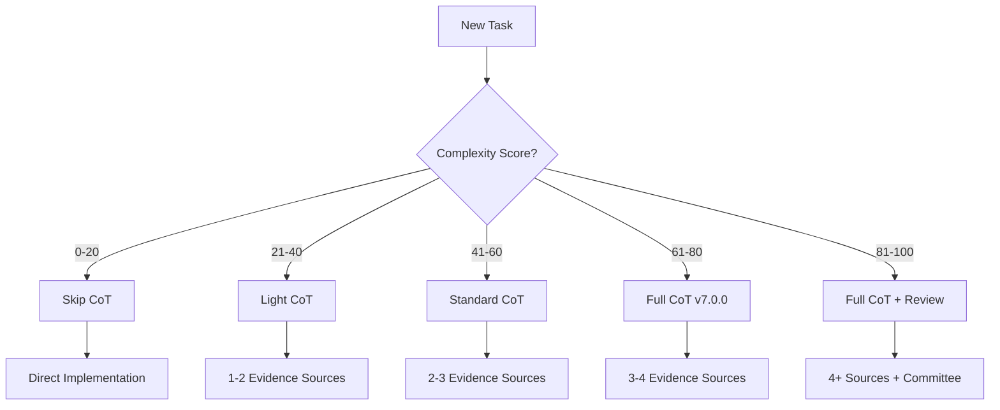

# 🎯 CoT Selection Guide
**Version**: 1.0.0  
**Purpose**: Decision framework for selecting appropriate Chain-of-Thought approach

---

## 🚀 Quick Decision Tree



---

## 📊 Complexity Scoring Algorithm

### Calculate Your Score

```python
def calculate_complexity_score(task):
    """
    Calculate task complexity score (0-100).
    
    Higher scores indicate more complex tasks requiring deeper reasoning.
    """
    score = 0
    
    # Factor 1: Stakeholder Impact (0-10 scale, weight: 10)
    # 0 = No stakeholders, 10 = Critical business/customer impact
    stakeholder_count = task.get_stakeholder_count()  # 0-10
    score += stakeholder_count * 10
    
    # Factor 2: Reversibility Cost (0-5 scale, weight: 20)
    # 0 = Easily reversible, 5 = Irreversible
    reversibility = task.get_reversibility_cost()  # 0-5
    score += reversibility * 20
    
    # Factor 3: Evidence Sources (0-10 scale, weight: 5)
    # More sources = more complex to analyze
    evidence_count = min(task.get_evidence_count(), 10)  # Cap at 10
    score += evidence_count * 5
    
    # Factor 4: Conflict Potential (0-5 scale, weight: 15)
    # 0 = No conflicts, 5 = High conflict potential
    conflict_risk = task.get_conflict_potential()  # 0-5
    score += conflict_risk * 15
    
    # Factor 5: Regulatory/Compliance Impact (0-4 scale, weight: 25)
    # 0 = None, 4 = High regulatory impact
    regulatory = task.get_regulatory_impact()  # 0-4
    score += regulatory * 25
    
    # Factor 6: Time Criticality (0-10 scale, weight: 10)
    # Paradox: More urgent = LESS time for CoT
    urgency = task.get_time_criticality()  # 0-10
    score += (10 - urgency) * 1  # Inverted: urgent tasks get lower score
    
    # Factor 7: Precedent Setting (0-3 scale, weight: 15)
    # 0 = Common pattern, 3 = First time/novel
    precedent = task.get_precedent_factor()  # 0-3
    score += precedent * 15
    
    return min(score, 100)  # Cap at 100
```

---

## 📋 Scoring Worksheet

Use this worksheet to calculate your task's complexity score:

| Factor | Your Value (0-N) | Weight | Subtotal |
|--------|------------------|--------|----------|
| **Stakeholder Impact** (0-10) | ___ | × 10 | = ___ |
| **Reversibility Cost** (0-5) | ___ | × 20 | = ___ |
| **Evidence Sources** (0-10) | ___ | × 5 | = ___ |
| **Conflict Potential** (0-5) | ___ | × 15 | = ___ |
| **Regulatory Impact** (0-4) | ___ | × 25 | = ___ |
| **Time Criticality** (10-N) | ___ | × 1 | = ___ |
| **Precedent Setting** (0-3) | ___ | × 15 | = ___ |
| **TOTAL SCORE** | | | **= ___/100** |

---

## 🎚️ Complexity Levels & CoT Requirements

### Level 0: Skip CoT (Score: 0-20)
**When to use:**
- Trivial fixes (typos, formatting)
- Adding comments
- Simple configuration changes
- Obvious bug fixes with clear solutions

**Requirements:**
- No formal reasoning required
- Direct implementation
- Document change in commit message

**Example Tasks:**
- Fix spelling error in documentation
- Update version number
- Add missing import statement
- Format code with linter

### Level 1: Light CoT (Score: 21-40)
**When to use:**
- Simple bug fixes
- Small feature additions
- Isolated refactoring
- Clear requirements

**Requirements:**
- 1-2 evidence sources
- Brief reasoning (2-5 minutes)
- Use CHAIN_OF_THOUGHT_LIGHT.md format
- Quick validation

**Example Tasks:**
- Add null check to prevent exception
- Extract method for readability
- Add simple validation
- Update deprecated API call

### Level 2: Standard CoT (Score: 41-60)
**When to use:**
- Medium features
- Cross-file refactoring
- Integration changes
- Performance optimizations

**Requirements:**
- 2-3 evidence sources
- Full reasoning trace (5-10 minutes)
- Consider alternatives
- Risk assessment
- Use standard CoT format

**Example Tasks:**
- Add caching layer
- Refactor module structure
- Implement new API endpoint
- Optimize database queries

### Level 3: Full CoT v7.0.0 (Score: 61-80)
**When to use:**
- Architecture changes
- Breaking changes
- Security updates
- Complex features

**Requirements:**
- 3-4 evidence sources
- Complete v7.0.0 reasoning
- Risk mitigation plan
- Temporal reasoning
- Conflict resolution
- Token budget management

**Example Tasks:**
- Migrate to new framework
- Change authentication system
- Refactor core business logic
- Implement complex algorithm

### Level 4: Full CoT + Review (Score: 81-100)
**When to use:**
- Critical system changes
- Compliance-related updates
- Data migration
- Infrastructure changes

**Requirements:**
- 4+ evidence sources
- Full v7.0.0 CoT
- Committee review required
- Escalation protocol active
- Comprehensive testing plan
- Rollback strategy

**Example Tasks:**
- Database schema migration
- Security architecture overhaul
- Payment system integration
- GDPR compliance implementation

---

## 🔍 Factor Definitions

### Stakeholder Impact (0-10)
- **0-2**: Internal team only
- **3-5**: Multiple teams affected
- **6-8**: Customer-facing impact
- **9-10**: Critical business impact

### Reversibility Cost (0-5)
- **0**: Trivial rollback (git revert)
- **1**: Simple rollback with testing
- **2**: Requires data cleanup
- **3**: Complex rollback procedure
- **4**: Very difficult to reverse
- **5**: Irreversible changes

### Evidence Sources (0-10)
Count of:
- Code files to review
- Documentation to check
- Requirements to verify
- External systems to consider
- Team members to consult

### Conflict Potential (0-5)
- **0**: No conflicts possible
- **1**: Minor style conflicts
- **2**: Technical approach differences
- **3**: Architectural disagreements
- **4**: Business logic conflicts
- **5**: Strategic direction conflicts

### Regulatory Impact (0-4)
- **0**: No compliance concerns
- **1**: Internal policies only
- **2**: Industry standards (ISO, etc.)
- **3**: Legal requirements (GDPR, etc.)
- **4**: Multiple regulatory bodies

### Time Criticality (0-10)
- **0-3**: No deadline
- **4-6**: Flexible deadline
- **7-8**: Fixed deadline
- **9-10**: Emergency/Critical

### Precedent Setting (0-3)
- **0**: Common, well-established pattern
- **1**: Variation of existing pattern
- **2**: New pattern for project
- **3**: Industry-first approach

---

## 🎯 Quick Reference Matrix

| Task Type | Typical Score | CoT Version | Time Investment |
|-----------|---------------|-------------|-----------------|
| **Typo fix** | 5 | Skip | < 1 min |
| **Add logging** | 15 | Skip | 2-5 min |
| **Fix null pointer** | 25 | Light | 5-10 min |
| **Add validation** | 30 | Light | 10-15 min |
| **Refactor class** | 45 | Standard | 15-30 min |
| **Add feature** | 55 | Standard | 30-60 min |
| **Change API** | 65 | Full v7.0.0 | 1-2 hours |
| **Migrate database** | 85 | Full + Review | 2-4 hours |

---

## 🚦 Override Conditions

### Force Higher CoT Level When:
- Security implications exist (minimum: Standard)
- Customer data involved (minimum: Full)
- Financial transactions (minimum: Full + Review)
- Regulatory compliance (minimum: Full)
- First-time pattern (add +20 to score)

### Allow Lower CoT Level When:
- Emergency hotfix required (max: Light)
- Reverting previous change (Skip CoT)
- Automated tool output (Skip CoT)
- Test-only changes (max: Light)

---

## 📝 Decision Audit Trail

Document your selection:

```markdown
## CoT Selection Decision

**Task**: [Brief description]
**Calculated Score**: XX/100
**Selected Level**: [Skip/Light/Standard/Full/Full+Review]
**Override Applied**: [Yes/No - Reason]
**Time Allocated**: XX minutes
**Decision By**: [Name/Role]
**Date**: YYYY-MM-DD
```

---

## 🔄 Feedback Loop

Track effectiveness:

```markdown
## Post-Implementation Review

**Predicted Complexity**: XX/100
**Actual Complexity**: XX/100
**CoT Level Used**: [Level]
**Was It Appropriate?**: [Yes/No]
**Issues Encountered**: [List]
**Recommendation for Next Time**: [Feedback]
```

---

## 💡 Tips for Accurate Scoring

1. **Be Conservative**: When in doubt, score higher
2. **Consider Dependencies**: Hidden complexity adds points
3. **Think Long-term**: Consider maintenance impact
4. **Check History**: Similar past tasks provide guidance
5. **Ask Team**: Collective assessment improves accuracy

---

## 🔗 Related Documents

- [CHAIN_OF_THOUGHT.md](./CHAIN_OF_THOUGHT.md) - Full v7.0.0 specification
- [CHAIN_OF_THOUGHT_LIGHT.md](./CHAIN_OF_THOUGHT_LIGHT.md) - Lightweight version
- [TASK_template.md](./TASK_template.md) - Task execution framework
- [COT_RUNTIME_CONTRACT.json](./COT_RUNTIME_CONTRACT.json) - Runtime requirements

---

**Guide Version**: 1.0.0  
**Last Updated**: 2025-08-08  
**Compatibility**: CoT v7.0.0, CoT Light v1.0.0