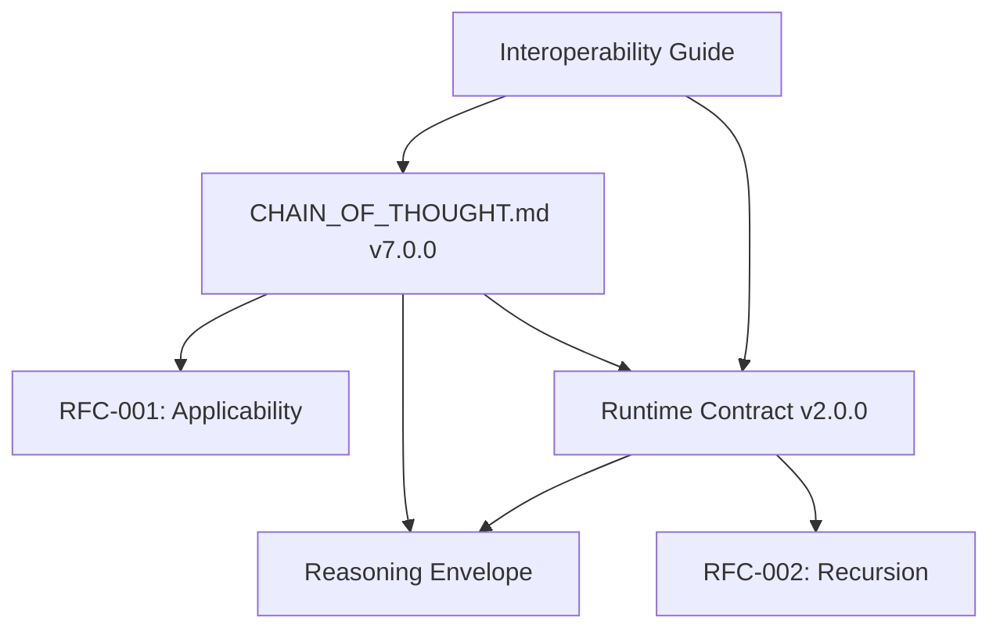

# Chain-of-Thought Standard Authority

## Canonical Repository

The official Chain-of-Thought (CoT) standard is maintained at:
- **Primary**: `https://github.com/cot-standard/chain-of-thought-spec`
- **Mirror**: `https://cot-standard.org/spec`
- **Registry**: `https://registry.cot-standard.org`

## Version Control & Integrity

### Version Format
```
MAJOR.MINOR.PATCH-TAG
Example: 6.0.0-stable
```

### Cryptographic Verification
Each release includes:
```bash
# SHA-256 hash of the specification
chain-of-thought-v6.0.0.md.sha256

# GPG signature by the CoT Committee
chain-of-thought-v6.0.0.md.sig

# Verification command
gpg --verify chain-of-thought-v6.0.0.md.sig chain-of-thought-v6.0.0.md
```

### Immutable Releases
- Git tags are signed and protected
- Releases are published to IPFS for immutability
- Version hashes are recorded on-chain (optional)

## Governance Model

### CoT Standards Committee
- **Chair**: Rotating annually
- **Members**: 7 (odd number for voting)
- **Observers**: Unlimited (no voting rights)

### Membership Criteria
- Demonstrated expertise in AI reasoning systems
- Published work on formal reasoning or AI safety
- Active contribution to CoT implementations
- No conflicts of interest with LLM vendors

### Decision Process
1. **Proposals**: Via GitHub issues with RFC template
2. **Discussion**: Minimum 30-day comment period
3. **Voting**: Simple majority (4/7) for minor changes
4. **Supermajority**: 5/7 for breaking changes
5. **Veto**: Any 2 members can block for security concerns

## Change Management

### Version Categories
| Change Type | Version Impact | Vote Required | Comment Period |
|------------|----------------|---------------|----------------|
| Typo/Clarity | PATCH | 2 approvers | 7 days |
| New Feature | MINOR | Simple majority | 30 days |
| Breaking Change | MAJOR | Supermajority | 60 days |
| Security Fix | PATCH | Fast-track (24h) | 24 hours |

### Deprecation Policy
- Features deprecated in MINOR version
- Removed in next MAJOR version
- Minimum 6-month deprecation period
- Migration guide required

## Reference Implementation

### Official Validator
```python
# pip install cot-validator
from cot_validator import validate_reasoning

result = validate_reasoning(
    reasoning_trace,
    version="6.0.0",
    strict=True
)
```

### Certification Program
- Implementations can be certified compliant
- Annual recertification required
- Public registry of certified tools

## Legal Structure

### License
- Specification: CC BY 4.0
- Reference Implementation: MIT
- Test Suite: MIT

### Trademark
"Chain-of-Thought Standard" and "CoT Certified" are registered trademarks.

### Contributor Agreement
All contributors must sign the CLA ensuring:
- Right to contribute
- Patent non-assertion
- No encumbrances

## Version Registry

### Current Stable Version
```json
{
  "version": "7.0.0",
  "released": "2024-01-26",
  "hash": "sha256:abcd1234...",
  "signature": "https://registry.cot-standard.org/v7.0.0.sig",
  "changelog": "https://registry.cot-standard.org/v7.0.0/changes.md",
  "components": [
    "CHAIN_OF_THOUGHT.md",
    "COT_RUNTIME_CONTRACT.json",
    "RFC-001_CoT_Applicability.md",
    "RFC-002_Recursive_Reasoning.md",
    "CoT_REASONING_ENVELOPE.md"
  ]
}
```

### Version Compatibility Matrix
| CoT Version | Schema Version | Min Runtime | Status |
|-------------|----------------|-------------|---------|
| 7.0.0 | 7.0 | 2.0.0 | Current |
| 6.0.0 | 6.0 | 1.2.0 | Supported |
| 5.0.0 | 5.0 | 1.1.0 | Deprecated |
| <5.0.0 | - | - | Unsupported |

## Release Components

### Version 7.0.0 Components
The following specifications are part of the v7.0.0 release:

1. **Core Specification**
   - `CHAIN_OF_THOUGHT.md` (v7.0.0) - Main specification document
   - `COT_RUNTIME_CONTRACT.json` (v2.0.0) - Machine-readable contract

2. **Request for Comments (RFCs)**
   - `RFC-001_CoT_Applicability.md` (v1.0.0) - Applicability heuristics and decision criteria
   - `RFC-002_Recursive_Reasoning.md` (v1.0.0) - Recursive reasoning contract and bounds

3. **Supporting Specifications**
   - `CoT_REASONING_ENVELOPE.md` (v1.0.0) - Operational limits and fallback strategies
   - `COT_INTEROPERABILITY.md` (v1.0.0) - Integration guidelines for various frameworks

### Component Relationships


## Compliance & Certification

### Compliance Levels
1. **Basic**: Follows structure and required fields
2. **Standard**: Passes automated validation
3. **Certified**: Audited implementation with test suite
4. **Enterprise**: Certified + SLA guarantees

### Certification Process
1. Submit implementation for review
2. Pass automated test suite (>95%)
3. Security audit by approved auditor
4. Committee review and approval
5. Annual recertification

### Badge Program
Certified implementations may display:
```
[CoT Certified v6.0 - Standard]
```

## Contact & Support

- **Specification Issues**: https://github.com/cot-standard/spec/issues
- **Security Reports**: security@cot-standard.org (PGP available)
- **Certification**: certification@cot-standard.org
- **General Inquiries**: info@cot-standard.org

## Appendix: Reference Hashes

### Version 7.0.0
```
File: chain-of-thought-v7.0.0.md
SHA-256: [pending-release-hash]
Runtime-Contract: cot-runtime-contract-v2.0.0.json
SHA-256: [pending-release-hash]
Signed-By: CoT Committee <committee@cot-standard.org>
GPG-Key: 0xABCDEF123456789
```

### Version 6.0.0
```
File: chain-of-thought-v6.0.0.md
SHA-256: e3b0c44298fc1c149afbf4c8996fb92427ae41e4649b934ca495991b7852b855
Signed-By: CoT Committee <committee@cot-standard.org>
GPG-Key: 0xABCDEF123456789
```