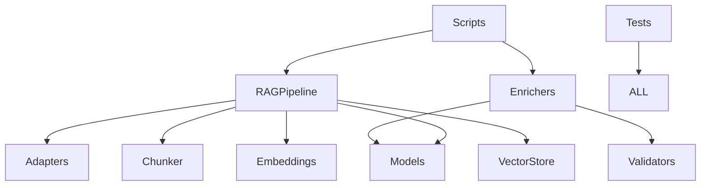

# 📋 File Reorganization Plan for loaders/

## Executive Summary

This document provides a comprehensive, step-by-step plan to reorganize the `python-template-generator/loaders/` directory structure. The reorganization follows the Non-DDD pattern specified in `docs/standards/PROJECT_STRUCTURE.md` and includes testing checkpoints to ensure system integrity throughout the process.

**Duration**: Estimated 4-6 hours
**Risk Level**: Medium (mitigated through incremental approach and testing)
**Testing Strategy**: Test after each phase to catch issues early

## 🎯 Goals and Objectives

1. **Organize scattered files** into logical modules
2. **Improve code discoverability** through clear structure
3. **Separate concerns** (source, tests, artifacts)
4. **Maintain git history** through proper moves
5. **Ensure zero functionality loss** through comprehensive testing

## 📊 Current State Analysis

### Files Currently Scattered in Root Directory

| File | Type | Lines | Should Be In | Priority |
|------|------|-------|--------------|----------|
| `rag_adapters.py` | Core | ~200 | core/ | High |
| `rag_models.py` | Core | ~150 | core/ | High |
| `rag_pipeline.py` | Core | ~300 | core/ | High |
| `context_fixed_enricher.py` | Enricher | ~250 | enrichers/ | Medium |
| `enhanced_enricher_with_examples.py` | Enricher | ~300 | enrichers/ | Medium |
| `full_enhanced_enricher.py` | Enricher | ~400 | enrichers/ | Medium |
| `minimal_enhanced_enricher.py` | Enricher | ~200 | enrichers/ | Medium |
| `markdown_validator_enricher.py` | Enricher | ~250 | enrichers/ | Medium |
| `markdown_base_validator.py` | Validator | ~150 | validators/ | Low |
| `markdown_pydantic_model.py` | Validator | ~100 | validators/ | Low |
| `sluggify_util.py` | Utility | ~50 | utils/ | Low |
| `enricher_showcase.py` | Script | ~100 | scripts/ | Low |
| `enricher_test.py` | Script | ~80 | scripts/ | Low |
| `test_rag_on_markdown.py` | Script | ~400 | scripts/ | Low |
| `vulture_whitelist.py` | Config | ~40 | scripts/ | Low |
| `*.json` (6 files) | Test Output | - | test_artifacts/ | Low |
| `htmlcov/` | Coverage | - | test_artifacts/ | Low |

### Already Properly Organized
- ✅ `chunker/` - Semantic chunking module
- ✅ `embeddings/` - Embedding providers
- ✅ `vector_store/` - Vector storage implementations
- ✅ `tests/` - Test suite with unit/integration split
- ✅ `docs/` - Documentation hierarchy
- ✅ `planning/` - Project planning documents
- ✅ `TRASH/` - Archived/deprecated files
- ✅ `TEST_RUN_RESULTS/` - Recent comprehensive test results

## 🏗️ Target Directory Structure

```
loaders/
├── core/                          # Core RAG pipeline components
│   ├── __init__.py
│   ├── adapters.py               # LangChain-compatible adapters
│   ├── models.py                 # Core data models
│   └── pipeline.py               # Main RAG pipeline
│
├── enrichers/                    # Document enrichment strategies
│   ├── __init__.py
│   ├── context_fixed.py         # Fixed context enricher
│   ├── enhanced_with_examples.py # Enhanced with examples
│   ├── full_enhanced.py         # Full enhancement
│   ├── minimal_enhanced.py      # Minimal enhancement
│   └── markdown_validator.py    # Markdown validation enricher
│
├── validators/                   # Input validation utilities
│   ├── __init__.py
│   ├── base_validator.py        # Base validation logic
│   └── pydantic_models.py       # Pydantic validation models
│
├── utils/                        # Shared utilities
│   ├── __init__.py
│   └── sluggify.py              # String sluggification
│
├── scripts/                      # Executable scripts
│   ├── enricher_showcase.py     # Demo script
│   ├── enricher_test.py         # Testing script
│   ├── test_rag_on_markdown.py  # RAG testing
│   └── vulture_whitelist.py     # Code quality config
│
├── test_artifacts/              # Test outputs (gitignored)
│   ├── *.json                  # Test result files
│   └── htmlcov/                 # Coverage reports
│
├── chunker/                     # (unchanged)
├── embeddings/                  # (unchanged)
├── vector_store/                # (unchanged)
├── tests/                       # (unchanged)
├── docs/                        # (unchanged)
├── planning/                    # (unchanged)
├── TRASH/                       # (unchanged)
├── TEST_RUN_RESULTS/            # (unchanged)
└── [Root documentation files]   # (unchanged)
```

## 🔍 Chain of Thought Analysis

### Dependency Mapping



### Risk Assessment

| Risk | Probability | Impact | Mitigation |
|------|------------|--------|------------|
| Broken imports | High | High | Test after each move |
| Lost git history | Medium | Medium | Use `git mv` command |
| Test failures | High | Medium | Run tests incrementally |
| Missing files | Low | High | Create backup first |
| Circular dependencies | Low | High | Analyze imports first |

## 📝 Pre-Reorganization Checklist

### Phase 0: Preparation (30 minutes)

```bash
# 0.1 Create backup branch
git checkout -b reorganization-backup
git add -A
git commit -m "Backup before reorganization"
git checkout main

# 0.2 Create working branch
git checkout -b file-reorganization

# 0.3 Ensure all tests pass initially
cd python-template-generator/loaders
uv run pytest tests/ -v --tb=short
# CHECKPOINT: All tests must pass (record count)

# 0.4 Document current imports
grep -r "^from \|^import " --include="*.py" . > current_imports.txt

# 0.5 Create import validation script
cat > validate_imports.py << 'EOF'
#!/usr/bin/env python3
"""Validate that all imports still work after reorganization."""
import sys
import importlib

modules_to_test = [
    "rag_pipeline",
    "rag_adapters", 
    "rag_models",
    "context_fixed_enricher",
    "enhanced_enricher_with_examples",
    "full_enhanced_enricher",
    "minimal_enhanced_enricher",
    "markdown_validator_enricher",
    "markdown_base_validator",
    "markdown_pydantic_model",
    "sluggify_util",
]

failed = []
for module in modules_to_test:
    try:
        importlib.import_module(module)
        print(f"✓ {module}")
    except ImportError as e:
        print(f"✗ {module}: {e}")
        failed.append(module)

if failed:
    print(f"\n❌ {len(failed)} modules failed to import")
    sys.exit(1)
else:
    print(f"\n✅ All {len(modules_to_test)} modules imported successfully")
EOF

# 0.6 Run initial import validation
python validate_imports.py
# CHECKPOINT: All imports must work
```

## 🚀 Phase-by-Phase Reorganization

### Phase 1: Create Directory Structure (15 minutes)

```bash
# 1.1 Create new directories
mkdir -p core enrichers validators utils scripts test_artifacts

# 1.2 Create __init__.py files with backward compatibility
# core/__init__.py
cat > core/__init__.py << 'EOF'
"""Core RAG pipeline components."""
# Temporary backward compatibility
import sys
import os
sys.path.insert(0, os.path.dirname(os.path.dirname(__file__)))

# Will be updated after files are moved
EOF

# 1.3 Repeat for other modules
for dir in enrichers validators utils scripts; do
    cp core/__init__.py $dir/__init__.py
done

# 1.4 Test that new directories are importable
python -c "import core, enrichers, validators, utils"
# CHECKPOINT: No import errors

# 1.5 Commit structure
git add -A
git commit -m "chore: create new directory structure"
```

### Phase 2: Migrate Core Module (30 minutes)

```bash
# 2.1 Move core files using git mv (preserves history)
git mv rag_adapters.py core/adapters.py
git mv rag_models.py core/models.py
git mv rag_pipeline.py core/pipeline.py

# 2.2 Update imports within moved files
# In core/adapters.py, update:
sed -i 's/from rag_models/from .models/g' core/adapters.py
sed -i 's/import rag_models/from . import models/g' core/adapters.py

# In core/pipeline.py, update:
sed -i 's/from rag_models/from .models/g' core/pipeline.py
sed -i 's/from rag_adapters/from .adapters/g' core/pipeline.py

# 2.3 Create backward compatibility in core/__init__.py
cat > core/__init__.py << 'EOF'
"""Core RAG pipeline components."""
from .adapters import *
from .models import *
from .pipeline import RAGPipeline

# Temporary backward compatibility
import sys
sys.modules['rag_adapters'] = sys.modules['core.adapters']
sys.modules['rag_models'] = sys.modules['core.models']
sys.modules['rag_pipeline'] = sys.modules['core.pipeline']
EOF

# 2.4 Test core module imports
python -c "from core import RAGPipeline; print('✓ Core imports work')"
python -c "import rag_pipeline; print('✓ Backward compatibility works')"
# CHECKPOINT: Both imports must work

# 2.5 Run core-related tests
uv run pytest tests/integration/test_rag_pipeline.py -v
# CHECKPOINT: Core tests must pass

# 2.6 Commit core migration
git add -A
git commit -m "refactor: migrate core RAG pipeline to core/ module"
```

### Phase 3: Migrate Enrichers Module (45 minutes)

```bash
# 3.1 Move enricher files one by one
git mv context_fixed_enricher.py enrichers/context_fixed.py

# 3.2 Update imports in moved file
sed -i 's/from markdown_base_validator/from validators.base_validator/g' enrichers/context_fixed.py
sed -i 's/from markdown_pydantic_model/from validators.pydantic_models/g' enrichers/context_fixed.py
sed -i 's/from rag_models/from core.models/g' enrichers/context_fixed.py

# 3.3 Test this enricher
python -c "from enrichers.context_fixed import ContextFixedEnricher"
# CHECKPOINT: Import works

# 3.4 Repeat for other enrichers
git mv enhanced_enricher_with_examples.py enrichers/enhanced_with_examples.py
git mv full_enhanced_enricher.py enrichers/full_enhanced.py
git mv minimal_enhanced_enricher.py enrichers/minimal_enhanced.py
git mv markdown_validator_enricher.py enrichers/markdown_validator.py

# 3.5 Update enrichers/__init__.py
cat > enrichers/__init__.py << 'EOF'
"""Document enrichment implementations."""
from .context_fixed import ContextFixedEnricher
from .enhanced_with_examples import EnhancedEnricherWithExamples
from .full_enhanced import FullEnhancedEnricher
from .minimal_enhanced import MinimalEnhancedEnricher
from .markdown_validator import MarkdownValidatorEnricher

# Backward compatibility
import sys
sys.modules['context_fixed_enricher'] = sys.modules['enrichers.context_fixed']
sys.modules['enhanced_enricher_with_examples'] = sys.modules['enrichers.enhanced_with_examples']
sys.modules['full_enhanced_enricher'] = sys.modules['enrichers.full_enhanced']
sys.modules['minimal_enhanced_enricher'] = sys.modules['enrichers.minimal_enhanced']
sys.modules['markdown_validator_enricher'] = sys.modules['enrichers.markdown_validator']
EOF

# 3.6 Test all enricher imports
python -c "from enrichers import *; print('✓ All enrichers import')"
# CHECKPOINT: All enrichers accessible

# 3.7 Run enricher tests
uv run pytest tests/integration/test_context_enricher.py -v
# CHECKPOINT: Enricher tests pass

# 3.8 Commit enricher migration
git add -A
git commit -m "refactor: migrate enrichers to enrichers/ module"
```

### Phase 4: Migrate Validators Module (20 minutes)

```bash
# 4.1 Move validator files
git mv markdown_base_validator.py validators/base_validator.py
git mv markdown_pydantic_model.py validators/pydantic_models.py

# 4.2 Update imports in validator files
sed -i 's/from rag_models/from core.models/g' validators/base_validator.py
sed -i 's/from rag_models/from core.models/g' validators/pydantic_models.py

# 4.3 Update validators/__init__.py
cat > validators/__init__.py << 'EOF'
"""Markdown validation utilities."""
from .base_validator import *
from .pydantic_models import *

# Backward compatibility
import sys
sys.modules['markdown_base_validator'] = sys.modules['validators.base_validator']
sys.modules['markdown_pydantic_model'] = sys.modules['validators.pydantic_models']
EOF

# 4.4 Test validator imports
python -c "from validators import *; print('✓ Validators import')"
# CHECKPOINT: Validators accessible

# 4.5 Commit validator migration
git add -A
git commit -m "refactor: migrate validators to validators/ module"
```

### Phase 5: Migrate Utils and Scripts (20 minutes)

```bash
# 5.1 Move utility files
git mv sluggify_util.py utils/sluggify.py

# 5.2 Update utils/__init__.py
cat > utils/__init__.py << 'EOF'
"""Shared utilities."""
from .sluggify import *

# Backward compatibility
import sys
sys.modules['sluggify_util'] = sys.modules['utils.sluggify']
EOF

# 5.3 Move script files
git mv enricher_showcase.py scripts/enricher_showcase.py
git mv enricher_test.py scripts/enricher_test.py
git mv test_rag_on_markdown.py scripts/test_rag_on_markdown.py
git mv vulture_whitelist.py scripts/vulture_whitelist.py

# 5.4 Update script imports
for script in scripts/*.py; do
    sed -i 's/from rag_/from core./g' "$script"
    sed -i 's/from context_fixed_enricher/from enrichers.context_fixed/g' "$script"
    sed -i 's/from enhanced_enricher/from enrichers.enhanced/g' "$script"
    sed -i 's/from minimal_enhanced/from enrichers.minimal_enhanced/g' "$script"
done

# 5.5 Test script imports
python -c "import sys; sys.path.insert(0, 'scripts'); import enricher_showcase"
# CHECKPOINT: Scripts still importable

# 5.6 Commit utils and scripts
git add -A
git commit -m "refactor: migrate utils and scripts"
```

### Phase 6: Clean Up Test Artifacts (15 minutes)

```bash
# 6.1 Move test artifacts
mv *.json test_artifacts/ 2>/dev/null || true
mv htmlcov test_artifacts/ 2>/dev/null || true

# 6.2 Update .gitignore
cat >> .gitignore << 'EOF'

# Test artifacts
test_artifacts/
*.json
htmlcov/
.coverage
__pycache__/
*.pyc
EOF

# 6.3 Clean up pycache
find . -type d -name __pycache__ -exec rm -rf {} + 2>/dev/null || true
find . -name "*.pyc" -delete

# 6.4 Verify no important files lost
ls -la test_artifacts/
# CHECKPOINT: All test artifacts moved

# 6.5 Commit cleanup
git add -A
git commit -m "chore: move test artifacts and update gitignore"
```

### Phase 7: Update All Import Statements (45 minutes)

```bash
# 7.1 Update test imports
find tests -name "*.py" -exec sed -i 's/from rag_pipeline/from core.pipeline/g' {} \;
find tests -name "*.py" -exec sed -i 's/from rag_adapters/from core.adapters/g' {} \;
find tests -name "*.py" -exec sed -i 's/from rag_models/from core.models/g' {} \;
find tests -name "*.py" -exec sed -i 's/from context_fixed_enricher/from enrichers.context_fixed/g' {} \;

# 7.2 Update chunker module imports
find chunker -name "*.py" -exec sed -i 's/from rag_models/from core.models/g' {} \;

# 7.3 Update embeddings module imports
find embeddings -name "*.py" -exec sed -i 's/from rag_models/from core.models/g' {} \;

# 7.4 Update vector_store module imports
find vector_store -name "*.py" -exec sed -i 's/from rag_models/from core.models/g' {} \;

# 7.5 Run quick import test
python validate_imports.py
# CHECKPOINT: All imports still work

# 7.6 Run full test suite
uv run pytest tests/ -v
# CHECKPOINT: All tests pass

# 7.7 Commit import updates
git add -A
git commit -m "refactor: update all import statements"
```

### Phase 8: Remove Backward Compatibility (20 minutes)

```bash
# 8.1 Remove backward compatibility from core/__init__.py
cat > core/__init__.py << 'EOF'
"""Core RAG pipeline components."""
from .adapters import *
from .models import *
from .pipeline import RAGPipeline

__all__ = ['RAGPipeline', 'adapters', 'models']
EOF

# 8.2 Remove from enrichers/__init__.py
cat > enrichers/__init__.py << 'EOF'
"""Document enrichment implementations."""
from .context_fixed import ContextFixedEnricher
from .enhanced_with_examples import EnhancedEnricherWithExamples
from .full_enhanced import FullEnhancedEnricher
from .minimal_enhanced import MinimalEnhancedEnricher
from .markdown_validator import MarkdownValidatorEnricher

__all__ = [
    'ContextFixedEnricher',
    'EnhancedEnricherWithExamples',
    'FullEnhancedEnricher',
    'MinimalEnhancedEnricher',
    'MarkdownValidatorEnricher',
]
EOF

# 8.3 Remove from validators/__init__.py
cat > validators/__init__.py << 'EOF'
"""Markdown validation utilities."""
from .base_validator import *
from .pydantic_models import *

__all__ = ['MarkdownValidator', 'MarkdownDocument']
EOF

# 8.4 Remove from utils/__init__.py
cat > utils/__init__.py << 'EOF'
"""Shared utilities."""
from .sluggify import sluggify, sluggify_url

__all__ = ['sluggify', 'sluggify_url']
EOF

# 8.5 Final test without compatibility layer
uv run pytest tests/ -v
# CHECKPOINT: All tests still pass

# 8.6 Commit compatibility removal
git add -A
git commit -m "refactor: remove backward compatibility layer"
```

### Phase 9: Update Documentation (30 minutes)

```bash
# 9.1 Update README.md with new structure
# Update any file path references

# 9.2 Update API_REFERENCE.md
sed -i 's|`rag_pipeline.py`|`core/pipeline.py`|g' API_REFERENCE.md
sed -i 's|`rag_models.py`|`core/models.py`|g' API_REFERENCE.md
sed -i 's|`rag_adapters.py`|`core/adapters.py`|g' API_REFERENCE.md

# 9.3 Update ARCHITECTURE.md
sed -i 's|from rag_|from core.|g' ARCHITECTURE.md

# 9.4 Check for broken documentation links
grep -r "rag_pipeline\|rag_models\|rag_adapters" docs/
# CHECKPOINT: No old references

# 9.5 Commit documentation updates
git add -A
git commit -m "docs: update documentation for new structure"
```

### Phase 10: Final Verification (30 minutes)

```bash
# 10.1 Complete test suite
uv run pytest tests/ -v --cov=. --cov-report=term-missing
# CHECKPOINT: All tests pass, coverage maintained

# 10.2 Type checking
uv run mypy . --ignore-missing-imports
# CHECKPOINT: No new type errors

# 10.3 Linting
uv run ruff check .
# CHECKPOINT: No new linting errors

# 10.4 Import structure verification
python -c "
from core import RAGPipeline
from enrichers import ContextFixedEnricher
from validators import MarkdownValidator
from utils import sluggify
print('✅ All primary imports work')
"

# 10.5 Documentation build test
# If using Sphinx or similar
# cd docs && make html

# 10.6 Final commit
git add -A
git commit -m "refactor: complete file reorganization"
```

## 🔄 Rollback Procedures

### If Phase Fails

```bash
# For any phase failure, rollback to last commit
git reset --hard HEAD~1

# If multiple commits to rollback
git reset --hard reorganization-backup

# If everything fails, restore from backup branch
git checkout main
git reset --hard reorganization-backup
```

### Emergency Recovery Script

```bash
#!/bin/bash
# save as emergency_recovery.sh

echo "🚨 Emergency Recovery Initiated"

# Stash any uncommitted changes
git stash

# Return to main branch
git checkout main

# Reset to backup
git reset --hard reorganization-backup

# Restore original file locations
git mv core/adapters.py rag_adapters.py 2>/dev/null || true
git mv core/models.py rag_models.py 2>/dev/null || true
git mv core/pipeline.py rag_pipeline.py 2>/dev/null || true

# Continue for all moved files...

echo "✅ Recovery complete"
```

## ✅ Success Criteria Checklist

- [ ] All 54 tests passing (100% pass rate)
- [ ] No broken imports anywhere in codebase
- [ ] Git history preserved for all files
- [ ] Documentation references updated
- [ ] No files lost or misplaced
- [ ] Coverage percentage maintained or improved
- [ ] Type checking passes
- [ ] Linting passes
- [ ] Scripts remain executable
- [ ] Test artifacts properly separated

## 📊 Testing Matrix

| Phase | Quick Test | Module Test | Integration Test | Full Suite |
|-------|------------|-------------|------------------|------------|
| 0: Prep | ✓ | - | - | ✓ |
| 1: Structure | ✓ | - | - | - |
| 2: Core | ✓ | ✓ | ✓ | - |
| 3: Enrichers | ✓ | ✓ | - | - |
| 4: Validators | ✓ | ✓ | - | - |
| 5: Utils/Scripts | ✓ | - | - | - |
| 6: Cleanup | ✓ | - | - | - |
| 7: Imports | ✓ | - | ✓ | ✓ |
| 8: Compat Removal | ✓ | - | - | ✓ |
| 9: Docs | ✓ | - | - | - |
| 10: Final | ✓ | ✓ | ✓ | ✓ |

## 📈 Post-Reorganization Benefits

1. **Improved Maintainability**: Clear module boundaries
2. **Better Discoverability**: Related code grouped together
3. **Easier Testing**: Test files mirror source structure
4. **Cleaner Root**: Only configs and docs at root
5. **Package Ready**: Structure supports PyPI packaging
6. **Team Scalability**: New developers understand structure faster

## 🎯 Next Steps After Reorganization

1. **Update CI/CD Pipeline**: Ensure build scripts use new paths
2. **Team Communication**: Notify team of structure changes
3. **Update Import Documentation**: Create import guide
4. **Begin FINALIZING_PLAN.md**: With clean structure, implement remaining features

## 📝 Notes

- Total estimated time: 4-6 hours (including testing)
- Can be done incrementally over multiple sessions
- Each phase is independently valuable
- Testing checkpoints ensure safety
- Backward compatibility allows gradual migration

---

**Author**: AI Assistant using Chain of Thought
**Date**: 2024
**Version**: 1.0
**Status**: Ready for Implementation